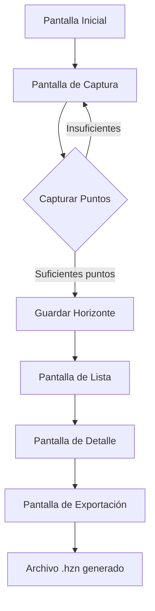

## 1. Descripción del Producto
Aplicación móvil Expo React Native que permite crear horizontes N.I.N.A. (Non Intersection Non Alignment) de forma offline utilizando sensores de movimiento del dispositivo. Los usuarios pueden capturar datos de orientación, exportar archivos .hzn y gestionar sus horizontes creados sin necesidad de conexión a internet.

- Problema a resolver: Facilitar la creación de horizontes N.I.N.A. para astrónomos aficionados y profesionales en ubicaciones remotas sin conectividad.
- Usuarios objetivo: Astrónomos aficionados, fotógrafos astronómicos, investigadores que trabajan en campo.
- Valor del producto: Herramienta portátil y confiable para captura precisa de datos de horizonte en cualquier ubicación.

## 2. Funcionalidades Principales

### 2.1 Roles de Usuario
| Rol | Método de Acceso | Permisos Principales |
|------|---------------------|------------------|
| Usuario Estándar | Uso directo de la app | Crear, editar, exportar horizontes |
| Usuario sin registro | Uso directo de la app | Crear y exportar horizontes (sin almacenamiento persistente) |

### 2.2 Módulos de Funcionalidad
La aplicación consta de las siguientes pantallas principales:
1. **Pantalla de Captura**: Visualización en tiempo real de sensores, botón de captura de puntos.
2. **Pantalla de Lista**: Listado de horizontes creados, opciones de gestión.
3. **Pantalla de Detalle**: Visualización del horizonte, opciones de edición y exportación.
4. **Pantalla de Exportación**: Configuración de formato .hzn y destino del archivo.

### 2.3 Detalle de Pantallas
| Nombre de Pantalla | Módulo | Descripción de Funcionalidad |
|-----------|-------------|---------------------|
| Pantalla de Captura | Visualización de sensores | Mostrar datos de DeviceMotion (inclinación, azimut, pitch, roll) en tiempo real |
| Pantalla de Captura | Botón de captura | Registrar punto de horizonte con coordenadas actuales al presionar botón |
| Pantalla de Captura | Indicador de progreso | Mostrar cantidad de puntos capturados y distribución angular |
| Pantalla de Lista | Listado de horizontes | Mostrar horizontes guardados con nombre, fecha y cantidad de puntos |
| Pantalla de Lista | Acciones de gestión | Permitir eliminar, renombrar y seleccionar horizontes |
| Pantalla de Detalle | Visualización gráfica | Mostrar gráfico polar del horizonte capturado |
| Pantalla de Detalle | Información del horizonte | Mostrar estadísticas (mínimo, máximo, promedio de altura) |
| Pantalla de Detalle | Botón de exportación | Iniciar proceso de exportación a formato .hzn |
| Pantalla de Exportación | Configuración de formato | Permitir seleccionar resolución angular y formato de archivo |
| Pantalla de Exportación | Destino del archivo | Opciones para guardar localmente o compartir |

## 3. Flujo Principal de Usuario

### Flujo de Captura de Horizonte
1. Usuario abre la aplicación y accede a "Nuevo Horizonte"
2. Se muestra la pantalla de captura con datos de sensores en tiempo real
3. Usuario se posiciona en punto de observación y comienza a capturar puntos
4. Alinea el dispositivo con el horizonte y presiona botón de captura
5. Repite proceso para cubrir 360 grados alrededor del punto
6. App valida cobertura mínima y permite guardar el horizonte
7. Usuario puede visualizar, editar y exportar el horizonte creado

## 4. Diseño de Interfaz

### 4.1 Estilo de Diseño
- **Colores principales**: Azul oscuro (#1a237e) para elementos principales, blanco para fondos
- **Colores secundarios**: Gris claro (#f5f5f5) para cards, verde (#4caf50) para acciones positivas
- **Estilo de botones**: Redondeados con sombra sutil, efecto de elevación al presionar
- **Tipografía**: Fuente sans-serif moderna (Roboto), tamaños: 16px para texto normal, 20px para títulos
- **Iconos**: Material Design Icons para consistencia con Android
- **Layout**: Cards con bordes redondeados y sombras, navegación por tabs inferiores

### 4.2 Diseño por Pantalla
| Pantalla | Módulo | Elementos de UI |
|-----------|-------------|-------------|
| Pantalla de Captura | Visualización de sensores | Cards con valores numéricos grandes, indicadores circulares para ángulos |
| Pantalla de Captura | Botón de captura | FAB (Floating Action Button) circular grande y centrado en parte inferior |
| Pantalla de Captura | Indicador de progreso | Barra circular que muestra cobertura angular completada |
| Pantalla de Lista | Listado de horizontes | Cards horizontales con preview gráfico miniatura, nombre y fecha |
| Pantalla de Detalle | Visualización gráfica | Gráfico polar interactivo con puntos de horizonte conectados |
| Pantalla de Detalle | Información estadística | Cards con métricas clave en formato tabular |
| Pantalla de Exportación | Configuración | Formulario con selectores para resolución y formato |

### 4.3 Adaptabilidad
- **Primario**: Diseño mobile-first optimizado para teléfonos
- **Adaptación**: Soporte para tablets con layout de dos columnas en pantallas grandes
- **Interacción**: Optimizado para touch con áreas táctiles mínimas de 48dp

### 4.4 Consideraciones de Sensores
- Calibración automática del giroscopio al iniciar captura
- Compensación de declinación magnética basada en ubicación GPS
- Validación de precisión de sensores antes de permitir captura
- Advertencias cuando la precisión de sensores es baja