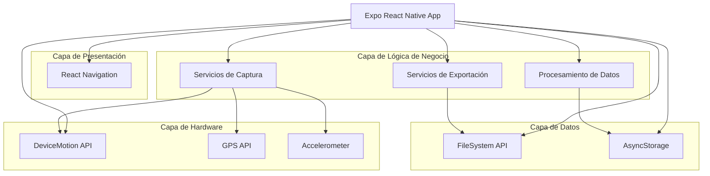

## 1. Diseño de Arquitectura



## 2. Descripción de Tecnologías

* **Frontend**: Expo SDK 49 + React Native 0.72 + TypeScript

* **Herramienta de Inicialización**: create-expo-app

* **Gestión de Estado**: React Context + useReducer

* **Navegación**: @react-navigation/native + @react-navigation/bottom-tabs

* **Sensores**: expo-sensors (DeviceMotion, Accelerometer)

* **Almacenamiento**: @react-native-async-storage/async-storage

* **Gráficos**: react-native-svg + react-native-chart-kit

* **Exportación**: expo-file-system + expo-sharing

## 3. Definición de Rutas

| Ruta        | Propósito                                                |
| ----------- | -------------------------------------------------------- |
| /           | Pantalla de captura, punto de entrada principal          |
| /list       | Listado de horizontes guardados                          |
| /detail/:id | Detalle y visualización de horizonte específico          |
| /export/:id | Configuración y generación de archivo .hzn               |
| /settings   | Configuración de la aplicación y calibración de sensores |

## 4. Definiciones de Tipos TypeScript

```typescript
// Tipos principales de datos
interface HorizonPoint {
  azimuth: number;      // 0-360 grados
  altitude: number;     // -90 a 90 grados
  timestamp: number;    // Unix timestamp
  accuracy: number;     // Precisión del sensor
}

interface HorizonData {
  id: string;
  name: string;
  createdAt: number;
  points: HorizonPoint[];
  location?: {
    latitude: number;
    longitude: number;
    altitude?: number;
  };
  metadata: {
    deviceModel: string;
    appVersion: string;
    sensorAccuracy: number;
  };
}

interface ExportOptions {
  resolution: number;     // Grados entre puntos
  format: 'standard' | 'detailed';
  includeMetadata: boolean;
  interpolateGaps: boolean;
}

interface DeviceMotionData {
  rotation: {
    alpha: number;    // Yaw (azimut)
    beta: number;     // Pitch
    gamma: number;    // Roll
  };
  acceleration: {
    x: number;
    y: number;
    z: number;
  };
  timestamp: number;
}
```

## 5. Estructura de Carpetas

```
horizon-nina-app/
├── src/
│   ├── components/
│   │   ├── capture/
│   │   │   ├── SensorDisplay.tsx
│   │   │   ├── CaptureButton.tsx
│   │   │   └── ProgressIndicator.tsx
│   │   ├── common/
│   │   │   ├── Header.tsx
│   │   │   └── Card.tsx
│   │   └── charts/
│   │       └── HorizonChart.tsx
│   ├── screens/
│   │   ├── CaptureScreen.tsx
│   │   ├── ListScreen.tsx
│   │   ├── DetailScreen.tsx
│   │   └── ExportScreen.tsx
│   ├── services/
│   │   ├── sensorService.ts
│   │   ├── horizonProcessor.ts
│   │   ├── exportService.ts
│   │   └── storageService.ts
│   ├── hooks/
│   │   ├── useDeviceMotion.ts
│   │   ├── useHorizonData.ts
│   │   └── useExport.ts
│   ├── utils/
│   │   ├── calculations.ts
│   │   ├── validators.ts
│   │   └── formatters.ts
│   ├── types/
│   │   └── index.ts
│   ├── constants/
│   │   └── index.ts
│   └── navigation/
│       └── AppNavigator.tsx
├── assets/
│   ├── icons/
│   └── images/
├── app.json
├── app.config.ts
├── babel.config.js
├── tsconfig.json
└── package.json
```

## 6. Servicios Principales

### 6.1 Servicio de Sensores

```typescript
class SensorService {
  async startMotionUpdates(callback: (data: DeviceMotionData) => void): Promise<void>
  async stopMotionUpdates(): Promise<void>
  async calibrateSensors(): Promise<CalibrationResult>
  getSensorAccuracy(): SensorAccuracy
}
```

### 6.2 Servicio de Procesamiento

```typescript
class HorizonProcessor {
  processRawData(points: DeviceMotionData[]): HorizonPoint[]
  interpolateGaps(points: HorizonPoint[], resolution: number): HorizonPoint[]
  validateHorizon(points: HorizonPoint[]): ValidationResult
  calculateStatistics(points: HorizonPoint[]): HorizonStatistics
}
```

### 6.3 Servicio de Exportación

```typescript
class ExportService {
  generateHznFile(horizon: HorizonData, options: ExportOptions): Promise<string>
  formatHorizonData(points: HorizonPoint[], format: ExportFormat): string
  shareFile(filePath: string): Promise<void>
}
```

## 7. Configuración de Permisos

### 7.1 Android (app.json)

```json
{
  "android": {
    "permissions": [
      "android.permission.ACCESS_FINE_LOCATION",
      "android.permission.ACCESS_COARSE_LOCATION",
      "android.permission.WRITE_EXTERNAL_STORAGE",
      "android.permission.READ_EXTERNAL_STORAGE"
    ],
    "package": "com.tuapp.horizonnina"
  }
}
```

### 7.2 iOS (app.config.ts)

```typescript
export default {
  ios: {
    infoPlist: {
      NSLocationWhenInUseUsageDescription: "Esta app necesita acceso a tu ubicación para calibrar los sensores de brújula",
      NSMotionUsageDescription: "Esta app necesita acceso a los sensores de movimiento para capturar el horizonte",
      UIFileSharingEnabled: true,
      LSSupportsOpeningDocumentsInPlace: true
    }
  }
}
```

## 8. Formato de Archivo .hzn

```
# N.I.N.A. Horizon File
# Generated by Horizon NINA App
# Location: Latitude, Longitude, Altitude
# Date: ISO 8601 Date
# Resolution: degrees
# Points: count

Latitude: 40.7128
Longitude: -74.0060
Altitude: 10
Date: 2024-01-01T12:00:00Z
Resolution: 5.0
Points: 72

# Azimuth(deg) Altitude(deg)
0.0 15.2
5.0 14.8
10.0 16.1
...continúa para 360 grados...
```

## 9. Consideraciones de Rendimiento

* **Optimización de sensores**: Muestreo a 10Hz máximo para conservar batería

* **Almacenamiento local**: Límite de 50 horizontes guardados (configurable)

* **Procesamiento**: Usar Web Workers para cálculos pesados

* **Memoria**: Liberar datos de sensores después de procesamiento

* **Exportación**: Generar archivo .hzn en chunks para horizontes grandes

## 10. Manejo de Errores

* **Sensores no disponibles**: Mostrar mensaje y sugerir calibración

* **Precisión baja**: Advertencia con opción de continuar o recalibrar

* **Almacenamiento lleno**: Notificar y sugerir exportar/eliminar horizontes antiguos

* **Exportación fallida**: Reintentar con formato alternativo o menor resolución

